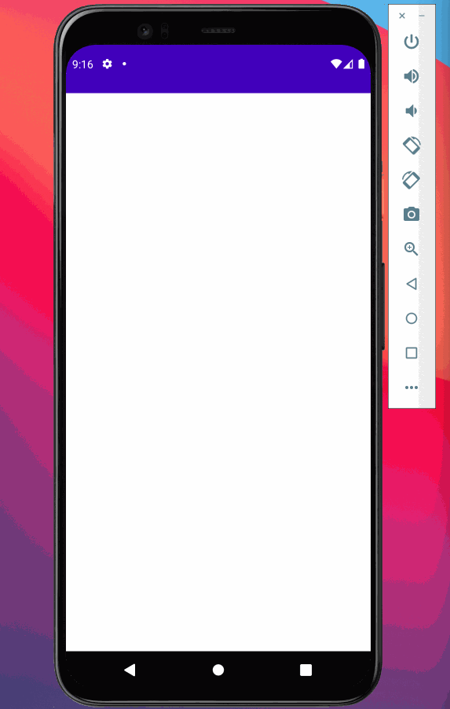

# Project 4 - *Instagram*

**Instagram** is a photo sharing app using Parse as its backend.

Time spent: **12** hours spent in total

## User Stories

The following **required** functionality is completed:

- [x] User sees app icon in home screen.
- [x] User can sign up to create a new account using Parse authentication
- [x] User can log in to his or her account
- [x] The current signed in user is persisted across app restarts
- [x] User can log out of his or her account
- [x] User can take a photo, add a caption, and post it to "Instagram"
- [x] User can view the last 20 posts submitted to "Instagram"
- [x] User can pull to refresh the last 20 posts submitted to "Instagram"
- [x] User can tap a post to go to a Post Details activity, which includes timestamp and caption.
- [x] User sees app icon in home screen

The following **stretch** features are implemented:

- [x] Style the login page to look like the real Instagram login page.
- [x] Style the feed to look like the real Instagram feed.
- [x] User should switch between different tabs using fragments and a Bottom Navigation View.
  - [x] Feed Tab (to view all posts from all users)
  - [x] Capture Tab (to make a new post using the Camera and Photo Gallery)
  - [x] Profile Tab (to view only the current user's posts, in a grid)
- [x] Show the username and creation time for each post
- User Profiles:
  - [x] Display the profile photo with each post
  - [x] User Profile shows posts in a grid

Please list two areas of the assignment you'd like to **discuss further with your peers** during the next class (examples include better ways to implement something, how to extend your app in certain ways, etc):

1. Fragments
2. Endless scrolling

## Video Walkthrough

Here's a walkthrough of implemented user stories:

GIF created with [Kap](https://getkap.co/).

## Credits

- [Android Async Http Client](http://loopj.com/android-async-http/) - networking library

## License

    Copyright 2021 Samantha Bautista

    Licensed under the Apache License, Version 2.0 (the "License");
    you may not use this file except in compliance with the License.
    You may obtain a copy of the License at

        http://www.apache.org/licenses/LICENSE-2.0

    Unless required by applicable law or agreed to in writing, software
    distributed under the License is distributed on an "AS IS" BASIS,
    WITHOUT WARRANTIES OR CONDITIONS OF ANY KIND, either express or implied.
    See the License for the specific language governing permissions and
    limitations under the License.
